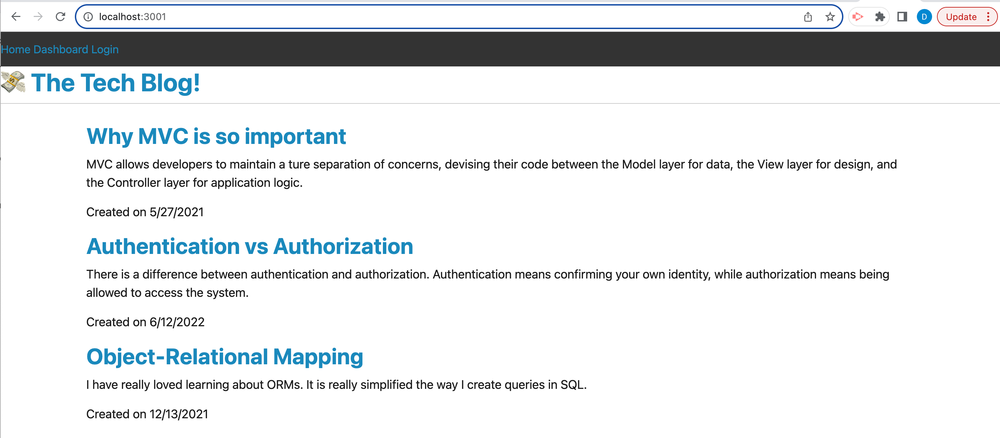

# cmsblog-wk14-drawlin

# Desription

This project was to create a CMS style blog site to allow users to publish articles, blog posts, and comments on posts. Upon getting to the homepage of the site, visitors are allowed to view previously submitted posts. Any other navigation links that are clicked on direct the user to either log in with existing credentials, or to sign up as first time visitors. Once signed in users are able to credit and edit their posts, or to comment on posts from other users.

# Installation

# Usage
Deployed site: https://cmsblog-wk14-drawlin-79c3f4e8219c.herokuapp.com/

# Credits

Peer coloboration:
Donnie Rawlings: https://github.com/drawlin22/
Kyle Jocoy: https://github.com/Kylyote/
Nedda Elsayed: https://github.com/Lven-Nemsy

Ask BSC- Royce Williams, David Gaither, John Armstrong, Sangetha Kaliaperumal, Jerromy Chance, Zack Xampanelli, Spider Forrest, Mia
KrispyWing
phind.com

# License
Please refer to the LICENSE in the repo.